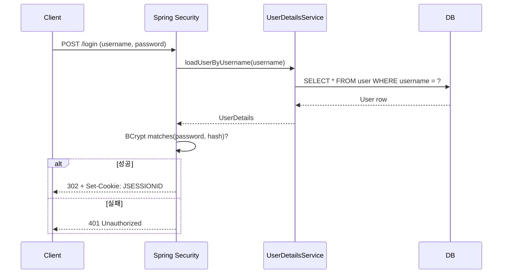

# AX 게시판 (Spring Boot)

> 회원가입 · 로그인 · 게시글 CRUD를 제공하는 최소 기능 게시판 백엔드 스펙 문서

본 문서는 **구현 이전 단계의 스펙 정의**입니다. 이 README만 보고도 동일한 결과물을 구현할 수 있도록 요구사항·도메인·API·정책을 일관된 형태로 기술합니다.

---

## 1. 프로젝트 개요

| 항목 | 내용 |
|---|---|
| 이름 | AX 게시판 |
| 목적 | Java Spring 기반 회원제 게시판의 참조 구현 |
| 대상 | 백엔드 학습·데모 용도. 단일 인스턴스 실행 가정 |
| 배포 | 미정 (로컬 개발 우선) |

## 2. 기술 스택

| 레이어 | 선택 |
|---|---|
| 언어 | **Java 17** |
| 프레임워크 | **Spring Boot 3.x** |
| 보안 | Spring Security (세션 기반) |
| 영속성 | Spring Data JPA + Hibernate |
| DB | **H2 (인메모리)** — 재시작 시 초기화 |
| 검증 | Bean Validation (`spring-boot-starter-validation`) |
| 빌드 | **Gradle (Kotlin DSL)** — `build.gradle.kts` |
| 테스트 | JUnit 5, Spring Boot Test |

## 3. 주요 기능

- **회원가입** — `username` 중복 체크, 비밀번호는 BCrypt 해시로 저장
- **로그인 / 로그아웃** — Spring Security 표준 세션 인증 (`JSESSIONID` 쿠키)
- **게시글 CRUD**
  - 목록 조회 (페이징)
  - 단건 조회
  - 작성 (로그인 필요)
  - 수정 / 삭제 (**작성자 본인만**)

## 4. 도메인 모델

```
┌──────────────┐          ┌──────────────┐
│    User      │ 1      N │    Post      │
├──────────────┤──────────├──────────────┤
│ id (PK)      │          │ id (PK)      │
│ username ★   │          │ title        │
│ password     │          │ content      │
│ nickname     │          │ author_id(FK)│
│ created_at   │          │ created_at   │
└──────────────┘          │ updated_at   │
     ★ = UNIQUE           └──────────────┘
```

### 4.1 User

| 필드 | 타입 | 제약 | 설명 |
|---|---|---|---|
| `id` | Long | PK, auto | 내부 식별자 |
| `username` | String(50) | NOT NULL, UNIQUE | 로그인 ID |
| `password` | String(100) | NOT NULL | BCrypt 해시 |
| `nickname` | String(30) | NOT NULL | 게시글에 노출되는 이름 |
| `createdAt` | LocalDateTime | NOT NULL | 가입 시각 |

### 4.2 Post

| 필드 | 타입 | 제약 | 설명 |
|---|---|---|---|
| `id` | Long | PK, auto | 게시글 ID |
| `title` | String(200) | NOT NULL | 제목 |
| `content` | TEXT | NOT NULL | 본문 |
| `author` | FK → User | NOT NULL | 작성자 |
| `createdAt` | LocalDateTime | NOT NULL | 작성 시각 |
| `updatedAt` | LocalDateTime | NOT NULL | 최종 수정 시각 |

## 5. API 명세

### 5.1 공통

- **Base URL**: `http://localhost:8080`
- **응답 포맷**: `application/json; charset=UTF-8`
- **인증**: 세션 쿠키 (`JSESSIONID`). 로그인 후 해당 쿠키를 동반해야 보호 엔드포인트 접근 가능
- **에러 응답 스키마**

```json
{
  "timestamp": "2026-04-21T14:30:00",
  "status": 400,
  "error": "Bad Request",
  "message": "username은 필수입니다.",
  "path": "/api/auth/signup"
}
```

### 5.2 엔드포인트 요약

| 메서드 | 경로 | 설명 | 인증 |
|---|---|---|---|
| POST | `/api/auth/signup` | 회원가입 | 공개 |
| POST | `/login` | 로그인 (form-urlencoded) | 공개 |
| POST | `/logout` | 로그아웃 | 인증 |
| GET | `/api/posts` | 게시글 목록 (페이징) | 공개 |
| GET | `/api/posts/{id}` | 게시글 단건 조회 | 공개 |
| POST | `/api/posts` | 게시글 작성 | 인증 |
| PUT | `/api/posts/{id}` | 게시글 수정 (작성자만) | 인증 |
| DELETE | `/api/posts/{id}` | 게시글 삭제 (작성자만) | 인증 |

### 5.3 주요 Request / Response

#### 회원가입

```http
POST /api/auth/signup
Content-Type: application/json

{
  "username": "alice",
  "password": "pw1234!",
  "nickname": "앨리스"
}
```

- 성공: `201 Created`
- 실패: `400` (검증 실패), `409` (username 중복)

#### 로그인

```http
POST /login
Content-Type: application/x-www-form-urlencoded

username=alice&password=pw1234!
```

- 성공: `302 Found` + `Set-Cookie: JSESSIONID=...`
- 실패: `401 Unauthorized`

#### 게시글 작성

```http
POST /api/posts
Cookie: JSESSIONID=...
Content-Type: application/json

{
  "title": "첫 글입니다",
  "content": "안녕하세요, AX 게시판입니다."
}
```

- 성공: `201 Created`

```json
{
  "id": 1,
  "title": "첫 글입니다",
  "content": "안녕하세요, AX 게시판입니다.",
  "authorNickname": "앨리스",
  "createdAt": "2026-04-21T14:35:12",
  "updatedAt": "2026-04-21T14:35:12"
}
```

#### 게시글 수정

```http
PUT /api/posts/1
Cookie: JSESSIONID=...
Content-Type: application/json

{
  "title": "수정된 제목",
  "content": "수정된 본문"
}
```

- 성공: `200 OK`
- 타인 글 수정 시: `403 Forbidden`

#### 게시글 목록

```http
GET /api/posts?page=0&size=10
```

- 성공: `200 OK`, Spring Data `Page<PostResponse>` 구조

## 6. 인증 & 권한 정책

- **인증**: Spring Security + Session (stateful). JWT 미사용
- **비밀번호**: `BCryptPasswordEncoder` (strength=기본 10)
- **인가 규칙**:
  - `permitAll`: `POST /api/auth/signup`, `GET /api/posts/**`, `/login`, `/logout`, `/h2-console/**`
  - 그 외 엔드포인트는 `authenticated()`
- **게시글 수정/삭제**: 서비스 계층에서 `현재 로그인 사용자 == post.author.username` 불일치 시 `AccessDeniedException`
- **CSRF**: 학습용 REST API 단순화를 위해 비활성화. 운영 전환 시 재도입 필요

### 6.1 로그인 흐름 (Mermaid)



## 7. 로컬 실행 방법 (예정)

> 현재 저장소에는 스펙 문서만 존재. 아래는 구현 단계 완료 후 기대 동작.

```bash
./gradlew bootRun
# → http://localhost:8080 기동
# → H2 콘솔: http://localhost:8080/h2-console
#   JDBC URL: jdbc:h2:mem:boarddb
```

### 7.1 테스트 실행

```bash
./gradlew test
```

MockMvc/단위 테스트와 Playwright 기반 E2E 테스트가 함께 실행됩니다.

**E2E 전제조건**: 로컬에 **Google Chrome** 이 설치되어 있어야 합니다. Playwright 는 번들 Chromium 다운로드를 우회(`PLAYWRIGHT_SKIP_BROWSER_DOWNLOAD=1`) 하고 시스템 Chrome(`channel="chrome"`) 을 사용합니다. CI 에서는 `browser-actions/setup-chrome` 액션이 자동 설치합니다.

### 7.1 시나리오 테스트 (curl)

```bash
# 1) 회원가입
curl -X POST http://localhost:8080/api/auth/signup \
  -H "Content-Type: application/json" \
  -d '{"username":"alice","password":"pw1234","nickname":"앨리스"}'

# 2) 로그인 (쿠키 저장)
curl -c cookies.txt -X POST http://localhost:8080/login \
  -d "username=alice&password=pw1234"

# 3) 게시글 작성
curl -b cookies.txt -X POST http://localhost:8080/api/posts \
  -H "Content-Type: application/json" \
  -d '{"title":"첫 글","content":"안녕하세요"}'

# 4) 목록 조회
curl http://localhost:8080/api/posts
```

## 8. 프로젝트 구조 (예정)

```
AX/
├── build.gradle.kts
├── settings.gradle.kts
├── gradlew, gradle/wrapper/
├── src/main/java/com/example/board/
│   ├── BoardApplication.java
│   ├── config/
│   │   └── SecurityConfig.java
│   ├── user/
│   │   ├── User.java
│   │   ├── UserRepository.java
│   │   ├── UserService.java
│   │   ├── CustomUserDetailsService.java
│   │   ├── AuthController.java
│   │   └── dto/SignupRequest.java
│   ├── post/
│   │   ├── Post.java
│   │   ├── PostRepository.java
│   │   ├── PostService.java
│   │   ├── PostController.java
│   │   └── dto/ (PostRequest, PostResponse)
│   └── common/
│       ├── GlobalExceptionHandler.java
│       └── ErrorResponse.java
├── src/main/resources/
│   └── application.yml
└── src/test/java/com/example/board/
    └── BoardApplicationTests.java
```

## 9. 범위 밖 / 로드맵

**이번 버전에 포함되지 않는 항목**

- 댓글 / 좋아요
- 파일·이미지 업로드
- JWT · OAuth2 소셜 로그인
- 비밀번호 재설정 / 이메일 인증
- 검색, 태그, 카테고리
- GitHub Actions CI, Docker 이미지
- 프런트엔드 UI (Thymeleaf / SPA)

**이후 고려**

- 페이지네이션 스펙 표준화 (커서 vs 오프셋)
- API 버저닝 전략 (`/api/v1/...`)
- OpenAPI(Swagger) 자동 문서화

## 10. 라이선스 · 기여

- 라이선스: TBD
- 기여 방법: PR 환영. 기능 제안은 Issue로 먼저 논의

---

> 이 문서는 구현 착수 전 합의된 스펙입니다. 실제 구현 과정에서 변경 사항이 발생하면 본 README를 최신 상태로 유지합니다.
